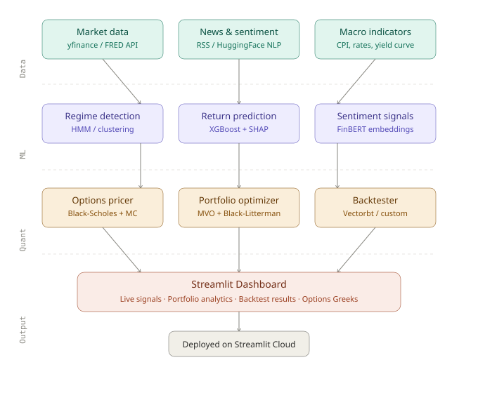

# AlphaLens — End-to-End Quantitative Investment Platform

> A full-stack quant finance project combining data science, machine learning, and quantitative finance into one unified, deployed application.

**Live Demo:** `[coming Day 7]` &nbsp;|&nbsp; **Stack:** Python · Pandas · XGBoost · FinBERT · Plotly · Streamlit

---

## What is AlphaLens?

AlphaLens is a personal quantitative investment research platform built from scratch. It ingests 5 years of real market and macroeconomic data, engineers 20+ features, scores financial news sentiment using a fine-tuned NLP model, trains a machine learning model to predict short-term returns, and ties everything together in an interactive Streamlit dashboard — all in one codebase.

The project deliberately covers three domains in one place:

- **Data Science** — real-world data ingestion, cleaning, and feature engineering
- **Machine Learning** — supervised classification with explainability (SHAP)
- **Quantitative Finance** — options pricing, portfolio optimization, backtesting

---

## Project Architecture


```
Raw Data Sources
      │
      ├── yfinance (OHLCV, 10 tickers, 5 years)
      └── FRED API (CPI, Fed rate, yields, unemployment)
            │
            ▼
    data_ingestion.py
    (merge_asof time-series join)
            │
            ▼
    feature_engineering.py
    (RSI, MACD, Bollinger, volume ratios, macro features, target variable)
            │
            ▼
    sentiment_engine.py
    (NewsAPI headlines → FinBERT → daily sentiment score per ticker)
            │
            ▼
    ml_model.py
    (XGBoost classifier → SHAP explainability)
            │
            ├── regime_detection.py (Hidden Markov Model)
            ├── options_pricer.py   (Black-Scholes + Monte Carlo)
            ├── portfolio_optimizer.py (Mean-Variance + Black-Litterman)
            └── backtester.py       (vectorized strategy vs SPY benchmark)
                        │
                        ▼
                    app.py
              (Streamlit Dashboard)
```

---

## Modules

### Module 1 — Data Pipeline (`data_ingestion.py`)

Pulls and merges two data sources into clean Parquet files:

**Market data via yfinance**
- 10 tickers: `AAPL MSFT GOOGL AMZN JPM GS SPY QQQ TSLA NVDA`
- 5 years of daily OHLCV data (open, high, low, close, volume)
- Derived columns: `daily_return`, `log_return`

**Macro data via FRED API**
- CPI (inflation), Federal Funds Rate, 10Y & 2Y Treasury Yields, Unemployment Rate
- Monthly FRED observations forward-filled to business days
- Derived: `yield_spread` (10Y − 2Y), `cpi_mom` (month-over-month CPI change)

**Key engineering decision:** used `pd.merge_asof` with `direction="backward"` to join monthly macro data onto daily market data — the correct approach for time-series data that avoids look-ahead bias.

Output files:
```
data/
├── market_data.parquet    (~12,500 rows × 8 cols)
├── macro_data.parquet     (~1,300 rows × 8 cols)
└── merged_data.parquet    (~12,500 rows × 14 cols)
```

---

### Module 2 — Feature Engineering (`feature_engineering.py`)

Computes 20+ technical and macro features per ticker per day:

**Trend indicators**
- EMA 12, EMA 26
- MACD, MACD Signal, MACD Histogram

**Momentum indicators**
- RSI (14-day)
- Rate of Change (10-day)
- Williams %R

**Volatility indicators**
- Bollinger Bands (upper, lower, width, %B)
- Average True Range (ATR)

**Volume indicators**
- On-Balance Volume (OBV)
- Volume vs 20-day moving average ratio

**Price-derived features**
- 5-day and 20-day rolling returns
- Distance from 52-week high and low

**Target variable**
- `target = 1` if price is higher 5 trading days from now, else `0`
- Strictly uses future data shifted by 5 days — no look-ahead leakage

---

### Module 3 — Sentiment Engine (`sentiment_engine.py`)

Scores daily financial news sentiment per ticker using FinBERT:

1. Fetches up to 100 recent headlines per ticker via NewsAPI
2. Passes headlines through `ProsusAI/finbert` — a BERT model fine-tuned on financial text
3. Computes sentiment score = `P(positive) − P(negative)` in range `[−1, +1]`
4. Aggregates to daily level: `sentiment_mean`, `sentiment_std`, `headline_count`
5. Forward-fills into the feature matrix (weekend/missing days carry last score)

FinBERT understands financial language that generic sentiment models miss — e.g. "the Fed raised rates by 75bps" is correctly scored as negative for equities.

---

### Module 4 — ML Return Predictor (`ml_model.py`)

Trains a binary classifier to predict 5-day return direction:

- **Model:** XGBoost (gradient boosted trees)
- **Features:** all technical indicators + macro features + sentiment score (~25 total)
- **Split:** strict time-series split — no random shuffling (avoids leakage)
- **Benchmark:** logistic regression baseline
- **Evaluation:** accuracy, F1, ROC-AUC, confusion matrix
- **Explainability:** SHAP summary plots show which features drive predictions

---

### Module 5 — Quant Engine

**Regime Detection** (`regime_detection.py`)
- Hidden Markov Model (3 states: bull / bear / sideways)
- Labels each trading day with a market regime
- Used to condition the ML strategy (only trade in bull regime)

**Options Pricer** (`options_pricer.py`)
- Black-Scholes analytical pricer for calls and puts
- Monte Carlo simulation (1,000 paths) as validation
- Computes Greeks: Delta, Gamma, Theta, Vega
- Compared against real market prices from yfinance options chain

**Portfolio Optimizer** (`portfolio_optimizer.py`)
- Mean-Variance Optimization (Markowitz efficient frontier)
- Filters the investable universe using ML model's top predicted tickers
- Outputs optimal portfolio weights that maximize Sharpe ratio

**Backtester** (`backtester.py`)
- Simulates the full ML + regime + optimization strategy historically
- Computes: Sharpe ratio, max drawdown, CAGR, win rate
- Benchmarks against buy-and-hold SPY

---

### Module 6 — Streamlit Dashboard (`app.py`)

Five interactive tabs, all built with Plotly:

| Tab | Content |
|-----|---------|
| Signals | Price chart with regime overlay + sentiment timeline |
| ML | Prediction table + SHAP waterfall chart |
| Portfolio | Efficient frontier + portfolio weights |
| Backtest | Equity curve vs SPY + performance metrics |
| Options | Greeks heatmap + Monte Carlo paths |

---

## EDA Highlights

Five exploratory charts are generated by `notebooks/eda.py` (all interactive Plotly HTML):

- **Price history** — 5-year normalized price chart for all 10 tickers
- **Yield curve** — 2Y vs 10Y treasury yields with spread (recession signal)
- **Return distributions** — violin plots showing daily return spread per ticker
- **Macro dashboard** — CPI, Fed rate, unemployment, 10Y yield over time
- **Correlation heatmap** — feature correlation matrix to spot multicollinearity

---

## Tech Stack

| Layer | Tools |
|-------|-------|
| Data ingestion | `yfinance`, `fredapi`, `pandas`, `pyarrow` |
| Technical indicators | `ta` |
| NLP / Sentiment | `transformers` (FinBERT), `torch`, `newsapi-python` |
| Machine learning | `xgboost`, `scikit-learn`, `shap` |
| Regime detection | `hmmlearn` |
| Quant finance | `numpy`, `scipy`, `vectorbt` |
| Visualization | `plotly` |
| Dashboard | `streamlit` |
| Environment | `python-dotenv`, `tqdm` |

---

## Setup & Usage

```bash
# 1. Clone
git clone git@github.com:Adi0015/alphalens.git
cd alphalens

# 2. Create virtual environment
python -m venv venv
source venv/bin/activate       # Mac/Linux
# venv\Scripts\activate        # Windows

# 3. Install dependencies
pip install -r requirements.txt

# 4. Add API keys
cp .env.example .env
# Edit .env and add:
# FRED_API_KEY=your_key_here
# NEWS_API_KEY=your_key_here

# 5. Run the pipeline
python data_ingestion.py       # Day 1 — fetch & merge data
python feature_engineering.py  # Day 2 — compute indicators
python sentiment_engine.py     # Day 2 — score sentiment
python ml_model.py             # Day 3 — train XGBoost

# 6. Launch dashboard
streamlit run app.py
```

---

## Project Timeline

Built in 7 days:

| Day | Focus | Output |
|-----|-------|--------|
| 1 | Data pipeline | 3 clean Parquet files, market + macro data |
| 2 | Feature engineering + sentiment | 25-column feature matrix with FinBERT scores |
| 3 | ML model | Trained XGBoost + SHAP explainability |
| 4 | Regime detection + options pricer | HMM labels + Black-Scholes Greeks |
| 5 | Portfolio optimizer + backtester | Efficient frontier + equity curve vs SPY |
| 6 | Streamlit dashboard | 5-tab interactive app |
| 7 | Deploy + polish | Live URL + complete README |

---

## Environment Variables

Create a `.env` file in the project root (never commit this):

```
FRED_API_KEY=your_fred_api_key
NEWS_API_KEY=your_newsapi_key
```

Get keys free at:
- FRED: https://fred.stlouisfed.org/docs/api/api_key.html
- NewsAPI: https://newsapi.org

---

## Repository Structure

```
alphalens/
├── data_ingestion.py          # Market + macro data pipeline
├── feature_engineering.py     # Technical indicators + target variable
├── sentiment_engine.py        # FinBERT sentiment scoring
├── ml_model.py                # XGBoost classifier + SHAP
├── quant/
│   ├── regime_detection.py    # Hidden Markov Model
│   ├── options_pricer.py      # Black-Scholes + Monte Carlo
│   ├── portfolio_optimizer.py # Mean-Variance Optimization
│   └── backtester.py          # Strategy backtesting
├── notebooks/
│   └── eda.py                 # Plotly exploratory analysis
├── app.py                     # Streamlit dashboard
├── requirements.txt
├── .env.example
└── README.md
```

---

## Interview Talking Points

**Data Science**
- Used `merge_asof` for time-series join — explains why a regular merge fails on monthly/daily data
- Forward-filled macro data to avoid gaps on non-reporting days

**Machine Learning**
- Strict time-series train/test split to prevent look-ahead leakage
- SHAP values to explain individual predictions — not just feature importance
- Compared XGBoost against logistic regression baseline

**Quant Finance**
- Monte Carlo validation of Black-Scholes pricer against real options chain prices
- Portfolio optimization conditioned on ML signal — combines both worlds
- Regime-aware strategy: only deploy capital in bull regimes

---

*Built by Adi0015 · April 2026*
